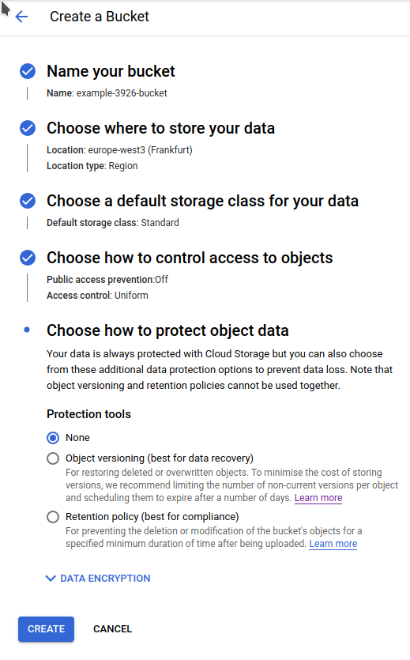

[install gcloud cli](https://cloud.google.com/sdk/docs/install)

[read me first](https://cloud.google.com/resource-manager/docs/creating-managing-projects#before_you_begin)
```shell
export PROJECT_ID=example-$RANDOM
gcloud projects create "$PROJECT_ID"
```
you should see `Operation [...] finished successfully`  
you need to [enable billing](https://cloud.google.com/billing/docs/how-to/modify-project#enable_billing_for_a_project), google offers a lot of free usage but you have to leave your credit card info. For financial safety, create a [budget alert](https://cloud.google.com/billing/docs/how-to/budgets#create-budget) so you get notified if anything is producing a bill.

[read me first](https://cloud.google.com/build/docs/automating-builds/build-repos-from-github#before_you_begin)
then fork this starter project
```shell
export GH_USER="your github username"
gcloud beta builds triggers create github \
        --build-config="/.google/cloudbuild.yaml" \
        --repo-name=serenity-junit-screenplay-starter \
        --repo-owner="$GH_USER" \
        --name=example-trigger \
        --branch-pattern='^main$'        
```
you should see `Operation [...] finished successfully.

create a bucket to store results... unfortunately no convenient CLI for that, so go to https://console.cloud.google.com/storage/create-bucket to create one like

and then change the artifacts: location in [the cloudbuild file](./cloudbuild.yaml)

make a change and push it

```shell
echo " " >> .google/README.md
git add .google/README.md
git commit -m "whitespace commit to trigger build"
git push origin main
```